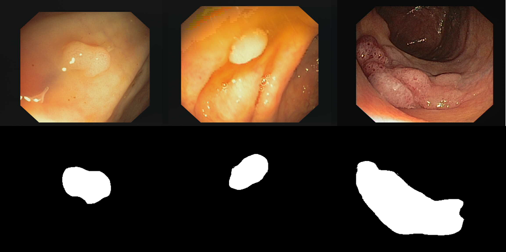

cvc-clinic-db
=============

.. image:: https://img.shields.io/badge/paperswithcode-📝-00cec9.svg?style=flat-square
    :target: https://paperswithcode.com/sota/medical-imgseg-on-cvc-clinicdb

.. image:: https://img.shields.io/badge/tasks-imgseg-8e44ad.svg?style=flat-square

usage
-----

   >>> import deeply.datasets as dd
   >>> dataset = dd.load("cvc_clinic_db")

summary
-------

CVC-ClinicDB is a database of frames extracted from colonoscopy videos. These frames contain several examples of polyps. In addition to the frames, the ground truth for the polyps has been provided. This ground truth consists of a mask corresponding to the region covered by the polyp in the image, as observed in the image below.

citation
--------

Bernal, Jorge, et al. “WM-DOVA Maps for Accurate Polyp Highlighting in Colonoscopy: Validation vs. Saliency Maps from Physicians.” Computerized Medical Imaging and Graphics, vol. 43, July 2015, pp. 99–111. ScienceDirect, https://doi.org/10.1016/j.compmedimag.2015.02.007.
---. “WM-DOVA Maps for Accurate Polyp Highlighting in Colonoscopy: Validation vs. Saliency Maps from Physicians.” Computerized Medical Imaging and Graphics: The Official Journal of the Computerized Medical Imaging Society, vol. 43, July 2015, pp. 99–111. PubMed, https://doi.org/10.1016/j.compmedimag.2015.02.007.

contributors
------------

Thanks to `@achillesrasquinha <https://github.com/achillesrasquinha>`_ for adding this dataset.