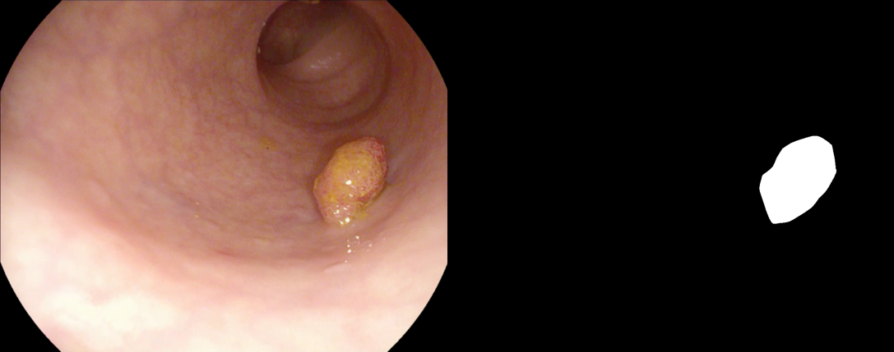

etis-larib
==========

.. image:: https://img.shields.io/badge/paperswithcode-📝-00cec9.svg?style=flat-square
    :target: https://paperswithcode.com/sota/medical-image-segmentation-on-etis

.. image:: https://img.shields.io/badge/tasks-imgseg-8e44ad.svg?style=flat-square

usage
-----

   >>> import deeply.datasets as dd
   >>> dataset = dd.load("etis_larib")

summary
-------

ETIS-Larib Polyp DB is a database of frames extracted from colonoscopy videos. These frames contain several examples of polyps. In addition to the frames, the ground truth for the polyps have been provided. This ground truth consists of a mask corresponding to the region covered by the polyp in the image, as observed in the image below.

citation
--------

Silva, Juan, et al. “Toward Embedded Detection of Polyps in WCE Images for Early Diagnosis of Colorectal Cancer.” International Journal of Computer Assisted Radiology and Surgery, vol. 9, no. 2, Mar. 2014, pp. 283–93. PubMed, https://doi.org/10.1007/s11548-013-0926-3.

contributors
------------

Thanks to `@achillesrasquinha <https://github.com/achillesrasquinha>`_ for adding this dataset.